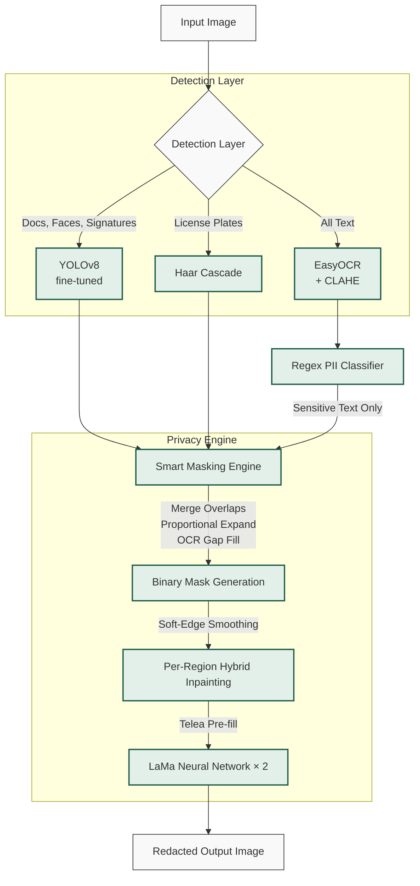

<div align="center">
  <h1>🛡️ VoidBox</h1>
  <h3>Multi-Modal PII Detection and Redaction Engine</h3> 
  
  <p>
    
    
    
    
    
  </p>
  
  <p><b>Privacy-first image anonymization running 100% locally. No cloud. No data leaves your machine.</b></p>
</div>

> **Evolved from [Context-Aware AI Eraser](https://github.com/vishva2410/context-aware-ai-eraser)**
> — what started as a simple face/plate blur tool is now a full-stack AI privacy engine featuring object detection, OCR with CLAHE preprocessing, semantic filtering, and neural inpainting (LaMa).

---

## 🏗️ Architecture



---

## Evolution Timeline

```
Stage 1-5    Context-Aware AI Eraser
             - YOLO-based face, plate, ID detection
             - Gaussian blur / solid fill redaction
             - Public vs Private context toggle
             - Basic web UI
                  |
                  v
Stage 6      + EasyOCR Integration
             - Added text detection layer
             - Unified object + text mask
             - Replaced blur with LaMa inpainting
             - Upgraded to Gradio Blocks UI
                  |
                  v
Stage 7      + Semantic PII Filtering
             - Regex-based text classification
             - 11 PII pattern categories
             - Smart / Aggressive / Off OCR modes
             - Live text analysis table in UI
             - Production-grade binary mask pipeline
                  |
                  v
Stage 8      + Hybrid Inpainting + Plate Detection
             - Haar cascade license plate detection
             - License plate regex patterns (IN/US/EU)
             - Soft-edge mask smoothing
             - Unified inpainting (Telea + LaMa × 2)
                  |
                  v
Stage 9      + Robust Mask Engineering
             - Overlapping box merging
             - Proportional adaptive expansion
             - Rounded rectangle masks
             - OCR internal gap filling
             - Per-region inpainting
             - Minimum area noise filter
             - Confidence threshold tuning
             - Mask statistics logging
```

---

## 🌟 Capabilities

### Hybrid Detection Layers
| Layer | Engine | What It Finds |
|-------|--------|---------------|
| **Object Detection** | YOLOv8 (fine-tuned on MIDV-2020) | Documents, faces, signatures, text fields |
| **Text Detection** | EasyOCR + CLAHE Optimization | All visible text in the image (even low contrast) |
| **PII Classification** | Regex Engine | Filters text into sensitive vs safe |

### PII Patterns Recognised
| Category | Pattern | Example |
|----------|---------|---------|
| **Aadhaar-style** | 12-digit number | `123456789012` |
| **Card number** | 16-digit number | `4111111111111111` |
| **Phone number** | 10-digit number | `9876543210` |
| **US SSN** | 3-2-4 format | `123-45-6789` |
| **Email** | standard format | `user@domain.com` |
| **Passport** | letter + 7 digits | `A1234567` |
| **PAN-style** | ABCDE1234F | `BXYPK4321M` |
| **License plates** | IN, US, EU, UK patterns | `MH12ABC1234` |
| **IP address** | dotted quad | `192.168.1.1` |
| **Date** | DD/MM/YYYY variants | `20/02/2026` |
| **MRZ** | 8+ uppercase alphanum | `P<INDBOSE<<SUBHAS` |

### 🛠️ Redaction Modes
| Mode | Behaviour |
|------|-----------|
| **Smart (Stage 7+)** | Only erases text matching defined PII patterns |
| **Aggressive** | Erases *all* detected text regardless |
| **Off** | Disables OCR entirely, YOLO-only |

---

## Project Structure

```
yolov8_project/
|-- app.py                     Main application (Gradio UI + pipeline)
|-- train.py                   YOLOv8 fine-tuning script
|-- download_midv2020.py       Dataset downloader (Roboflow API)
|-- prepare_dataset.py         Dataset validation and class remapping
|-- prepare_signatures.py      Signature dataset preparation for YOLO
|-- generate_synthetic_data.py Synthetic ID card generator (bootstrap)
|-- models/
|   |-- fine_tuned.pt          Fine-tuned PII detection model
|   |-- yolov8n.pt             Base YOLOv8 model (fallback)
|-- datasets/
|   |-- midv2020/              Real identity document dataset
|   |-- custom_id_data/        Synthetically generated training data
|   |-- signatures/            Signature detection dataset
|-- outputs/                   Test output directory
|-- venv/                      Python virtual environment
```

---

## Setup

### Prerequisites

- Python 3.10+
- macOS / Linux / Windows (MPS, CUDA, or CPU)

### Installation

```bash
cd "void box/yolov8_project"
python -m venv venv
source venv/bin/activate        # Windows: venv\Scripts\activate

pip install ultralytics opencv-python-headless gradio
pip install simple-lama-inpainting easyocr torch numpy pillow pyyaml
```

### Run

```bash
source venv/bin/activate
python app.py
```

The Gradio interface launches at `http://localhost:7860` with a public share link.

---

## Training Your Own Model

### Option A: Download MIDV-2020 (recommended)

```bash
python download_midv2020.py --api-key YOUR_ROBOFLOW_KEY
python prepare_dataset.py --remap
python train.py --epochs 50
```

### Option B: Synthetic data (quick test)

```bash
python generate_synthetic_data.py
python train.py --data datasets/custom_id_data/data.yaml --epochs 10
```

The best model is automatically saved to `models/fine_tuned.pt` and loaded by `app.py` on next launch.

---

## Technical Details

## 🔬 Technical Highligts

### Smart Mask Generation Pipeline
To prevent LaMa from degrading image quality with excessively large or disjoint masks, this project implements a highly tuned mask geometry engine:

1. **Minimum area filter** — boxes smaller than 100px² are discarded as noise.
2. **Overlapping box merging** — iteratively unions overlapping detections into single, clean regions.
3. **Proportional expansion** — adapts padding to box size (18% of max dimension, clamped 12–50px) to give the neural network enough surrounding context.
4. **Rounded rectangle masks** — draws masks with rounded corners (~12% of short side) to drastically reduce visible harsh seam artifacts.
5. **OCR gap filling** — when multiple individual OCR words overlap a single YOLO region (like an ID card), the whole object box replaces the scattered words, avoiding a "swiss cheese" mask that confuses the inpainter.
6. **Soft-edge smoothing** — Gaussian blur on mask edges + re-threshold removes pixel-perfect jagged borders.
7. **Per-region hybrid inpainting** — each connected component gets its own localized **Telea → LaMa × 2** pass, meaning no giant global masks degrade independent textures.

### Device Selection

Automatically selects the best available backend:

```
CUDA (NVIDIA GPU)  >  MPS (Apple Silicon)  >  CPU
```

---

## Limitations

- OCR may miss small, low-contrast, or stylised text
- Regex does not catch names, addresses, or contextual secrets (requires NER / LLM — future work)
- LaMa inpainting quality depends on mask precision and surrounding texture availability
- Fine-tuned model accuracy depends on training data diversity

---

## Roadmap

```
Current    Stage 9: Robust Mask Engineering
                |
Planned    Stage 10: Named Entity Recognition (spaCy / transformer)
                |
           Stage 11: LLM-based contextual classification
                |
           Stage 12: Video pipeline (frame-by-frame redaction)
```

---

## License

MIT License. See [LICENSE](LICENSE) for details.

---

**VoidBox** — from blur tool to AI privacy engine.
